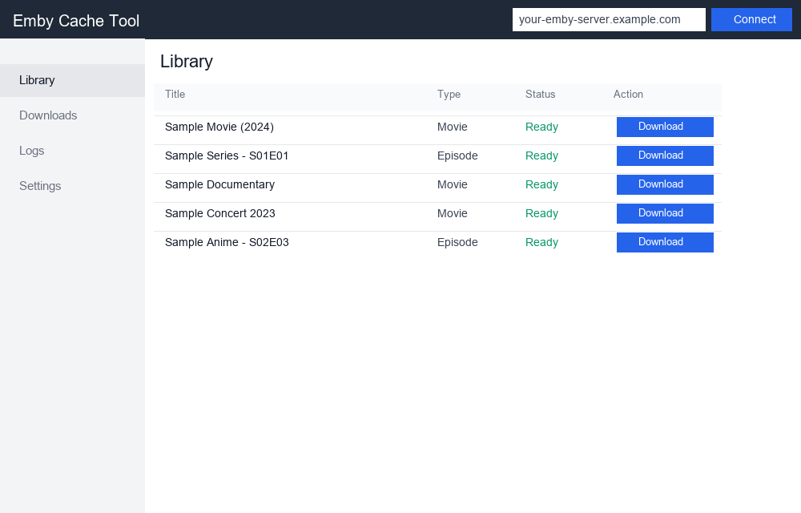
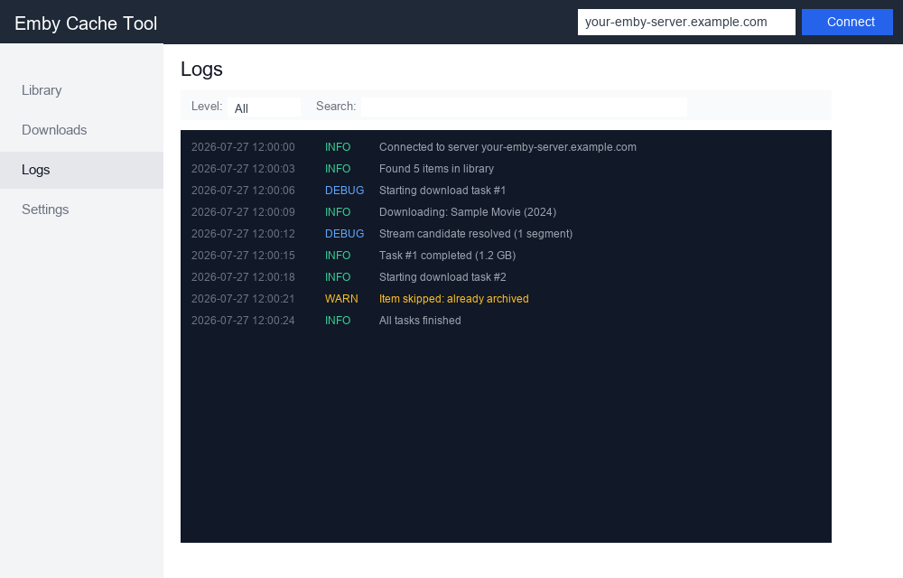

# emby-cache-tool

> **项目已更名为 [emby-archiver](https://github.com/你的用户名/emby-archiver)**，本仓库仍保留原名以便兼容。

---

# emby-archiver

一个可在 Windows、本地终端、Termux / 无图形环境下使用的 Python 工具，用 Emby 账号登录服务器，把能访问的视频离线归档到本地。

## 关于 emby-archiver

如果你有一个 Emby 媒体服务器的账号，想把自己能访问的电影、剧集下载到本地离线观看——不管是笔记本、小主机、还是挂着 Termux 的手机——这个工具就是为你做的。

它不是 Emby 客户端，不是在线播放器，也不是边播边缓存的流媒体工具。它的定位很明确：**一个把 Emby 资源离线归档到本地的下载器**。

### 为什么会有这个项目

很多 Emby 用户会遇到这些场景：

- 家里的 Emby 服务器资源不错，但网络不稳定，想下载到笔记本离线看
- 共享账号的服务器随时可能关停，想趁能访问时把想看的存下来
- 想在无图形环境的服务器 / VPS / NAS / Termux 上也能跑一个下载工具
- Web 端的 Emby 虽然能在线播放，但很多浏览器不支持特殊编码，离线转存更省事
- 账号没有 `DownloadContent` 权限，`Items/{id}/Download` 返回 403，需要绕道 `Videos/stream` 自己处理下载链路

现有的 Emby 客户端大多偏播放，缺少一个**纯粹的离线归档工具**。这个项目就是来填这个空白的。

### 三条入口，随处可用

| 入口 | 文件 | 适合场景 |
|------|------|----------|
| CLI | `main.py` | 终端操作、脚本调用、自动化 |
| GUI | `gui.py` | 桌面场景，像正常使用软件一样下载 |
| Web | `webapp.py` | 无图形环境、远程访问、手机/Termux 浏览器 |

默认 `auto` 模式自动选择：有桌面走 GUI，没桌面走 Web。

### 核心特点

- **分段并发下载**：支持多线程分段，不支持 Range 的服务端自动回退单线程
- **断点续传**：`.part` 临时文件随时可中断、可续传，不用担心网络抖动
- **SQLite 记录**：下载历史持久化，已完成的自动跳过不会重复下
- **现实约束优先**：针对无 `DownloadContent` 权限的账号，走 `Videos/stream` 候选链路
- **可选实验性分段**：对不支持标准 Range 的服务端，可强制试探真实分段
- **代理支持**：HTTP/HTTPS 代理复用，适合需要走代理链路的场景
- **Web 完整日志**：历史日志文件切换、级别过滤、关键词搜索、行号显示

### 当前限制

- 没有实现 HLS 分片合并，部分特殊资源可能无法离线
- Web 端按远程场景做了降级，不在浏览器里调用本地播放器
- 没有做账号认证，局域网使用需注意安全

### 适用人群

- 有 Emby 共享账号、想离线归档资源的用户
- 在无图形环境（NAS、小主机、Termux）上跑下载工具的用户
- 需要一个纯粹下载工具、而不是又一个播放器的用户

## 预览

### Web UI 概览



### 日志面板



支持多历史日志文件切换、级别过滤、关键词搜索、自动滚动、加载更多。

---

## 当前能力

### 三条入口

| 入口 | 说明 | 启动方式 |
|------|------|----------|
| CLI | 纯终端操作 | `python app.py --mode cli` |
| Tkinter GUI | 桌面图形界面 | `python app.py --mode gui` 或 `python gui.py` |
| Web | 浏览器访问，支持手机/Termux | `python app.py --mode web` |

默认 `auto` 模式：有图形环境走 Tkinter，没有自动回退 Web。

### 核心功能

- 用户名 + 密码登录 Emby
- 兼容 `access_token` 或 `api_key` 方式
- 列出媒体库、搜索电影 / 剧集 / 季 / 集
- 下载单个电影，或展开整季 / 整部剧集逐集下载
- 支持 `.part` 临时文件断点续传
- 用 SQLite 记录缓存状态
- 优先走多线程分段下载，不支持 `Range` 时自动回退单线程
- 可选开启实验性强制分段探测
- 支持为认证和下载链路配置 HTTP/HTTPS 代理

### Web 特有功能

- 搜索资源、发起下载、查看实时状态（速度/ETA/百分比/进度条）
- 暂停 / 继续 / 取消当前下载（取消时可选删除/保留 .part 临时文件）
- 设置默认下载目录（可持久化到 config.json）
- 调节并发分段数（1-32）
- 下载记录管理（继续未完成、删除已完成/未完成）
- 完整日志系统：多历史文件切换、级别过滤、关键词搜索、行号、自动滚动
- 摘要栏显示代理配置、experimental_force_multipart 状态

---

## 快速开始

### 1. 准备配置

```bash
cp config.example.json config.json
# 编辑 config.json 填入你的 Emby 地址和账号信息
```

### 2. 安装依赖

```bash
pip install -r requirements.txt
```

### 3. 启动

```bash
# 默认 auto 模式（有 GUI 走 Tkinter，没有走 Web）
python app.py

# 强制 Web 模式
python app.py --mode web --host 127.0.0.1 --port 8765

# 局域网/手机访问（需配合安全措施）
python app.py --mode web --host 0.0.0.0 --port 8765
```

打开浏览器访问：`http://127.0.0.1:8765`

---

## 配置说明

```json
{
  "server_url": "https://your-emby-server.example.com",
  "username": "your_username",
  "password": "your_password",
  "api_key": "",
  "access_token": "",
  "user_id": "",
  "download_dir": "downloads",
  "database_path": "store/cache.db",
  "device_name": "emby-cache-tool",
  "user_agent": "emby-cache-tool/0.1",
  "timeout": 30,
  "chunk_size": 1048576,
  "segments": 4,
  "experimental_force_multipart": false,
  "proxy": "",
  "proxy_http": "",
  "proxy_https": "",
  "log_dir": "logs",
  "log_level": "INFO",
  "stream_segments": 2
}
```

### 配置项详解

| 配置项 | 说明 |
|--------|------|
| `server_url` | Emby 服务器地址 |
| `username` / `password` | 登录账号（优先级最高） |
| `access_token` | 备选认证方式 |
| `api_key` | 备选认证方式，建议同时填 `user_id` |
| `download_dir` | 默认下载目录，相对路径或绝对路径均可 |
| `database_path` | SQLite 数据库路径 |
| `segments` | 分段并发数（1-32），仅服务端支持 Range 时生效 |
| `experimental_force_multipart` | 是否开启实验性强制分段探测 |
| `proxy` | 同时作用于 HTTP/HTTPS 的代理 |
| `proxy_http` / `proxy_https` | 分别配置 HTTP/HTTPS 代理 |
| `log_dir` | 日志目录，默认 `logs/` |
| `log_level` | 日志级别：`DEBUG` / `INFO` / `WARNING` / `ERROR` |
| `stream_segments` | Videos/stream 候选允许的最大分段数，默认 2 |

---

## 使用指南

### CLI 用法

```bash
# 登录测试
python app.py --mode cli login-test

# 列出媒体库
python app.py --mode cli libraries

# 搜索资源
python app.py --mode cli search "你的关键字"

# 下载指定 item
python app.py --mode cli download --item-id 123456

# 查看下载记录
python app.py --mode cli downloads

# 继续未完成的下载
python app.py --mode cli resume
```

### GUI 用法

```bash
python gui.py
```

GUI 支持：加载配置、测试登录、搜索资源、选择默认下载目录、双击下载、查看下载记录和日志、实时速度/ETA/进度百分比、暂停/继续/取消、播放已完成文件、删除文件和记录。

### Web 用法

```bash
python app.py --mode web --host 127.0.0.1 --port 8765
```

Web 支持：测试登录、搜索资源、发起下载、单次指定下载目录、忽略 .part 重新开始、查看当前下载状态（实时进度条+速度+ETA）、暂停/继续/取消（可选删除/保留临时文件）、设置默认下载目录（可持久化）、调节并发数、下载记录管理（继续/删除）、完整日志系统（历史文件切换+级别过滤+搜索）。

---

## 下载说明

### 文件组织

- 电影按 `片名 (年份)/片名 (年份).扩展名` 保存
- 剧集按 `剧名/Season 01/S01E01 - 标题.扩展名` 保存

### 分段下载逻辑

1. 默认使用 `segments` 设置的并发数
2. 服务端不支持 `Range` 时自动回退单线程
3. 开启 `experimental_force_multipart` 后，会直接试探真实分段请求验证是否可强制分段
4. `stream_segments` 控制 `Videos/stream` 候选允许的最大分段数，避免一上来用太高并发把流地址打崩
5. 已有 `.part` 断点文件需要续传时，自动走单线程续传

### 断点续传

- 目标文件已存在且下载记录已完成 → 直接跳过
- 已有 `.part` 文件 → 自动续传（保留断点）
- 勾选"忽略 .part 重新开始" → 删除现有断点并重新下载
- 取消下载时 → 可选择删除或保留 `.part` 临时文件

### 日志说明

- GUI / Web 日志会显示候选地址类型、标准 Range 探测结果、实验分段探测结果和最终决策
- 下载记录会保存本次任务最终使用的模式，例如：
  - `分段并发下载（4 段）`
  - `实验性强制分段下载（4 段）`
  - `单线程续传（保留已有 .part）`
  - `单线程回退（服务端不支持分段）`

---

## 技术栈

| 组件 | 技术 |
|------|------|
| CLI | Python 标准库 |
| GUI | Tkinter |
| Web | Starlette + uvicorn |
| 数据库 | SQLite |
| 下载 | requests + 自研分段引擎 |
| 日志 | Python logging |

---

## 已知限制

- 共享账号服务器如果限制 API，可能无法登录或无法下载
- 某些服务器只给短期播放链接，失败时建议改用 `access_token`
- 正在运行中的旧下载进程不会热更新，必须重启 GUI / Web / 脚本后新逻辑才会生效
- 当前暂停/继续是进程内控制；如果直接关掉 GUI 或 Web 服务，需要靠 `.part` + `resume` 恢复
- 部分不稳定服务端在暂停太久后可能主动断流，继续时会自动按现有断点续传策略重试
- HLS 分片合并仍未实现，部分特殊资源可能无法直接离线

---

## 项目结构

```
emby-cache-tool/
├── app.py              # 统一启动入口
├── app_service.py      # 统一业务层
├── webapp.py           # Web 应用（Starlette）
├── gui.py              # Tkinter GUI
├── main.py             # CLI 入口
├── downloader.py       # 下载核心
├── emby_client.py      # Emby API 封装
├── library.py          # SQLite 下载记录
├── config.py           # 配置读取
├── models.py           # 数据模型
├── logger.py           # 日志配置
├── config.json         # 配置文件（需自行创建）
├── config.example.json # 配置示例
├── requirements.txt    # 依赖声明
├── docs/images/        # 截图
├── downloads/          # 默认下载目录
├── logs/               # 日志目录
└── store/              # SQLite 数据库目录
```

---

## 认证建议

优先级：
1. 直接用 `username` + `password`
2. 如果服务器不让密码登录，改用 `access_token`
3. 如果你拿到的是 `api_key`，最好同时填 `user_id`
